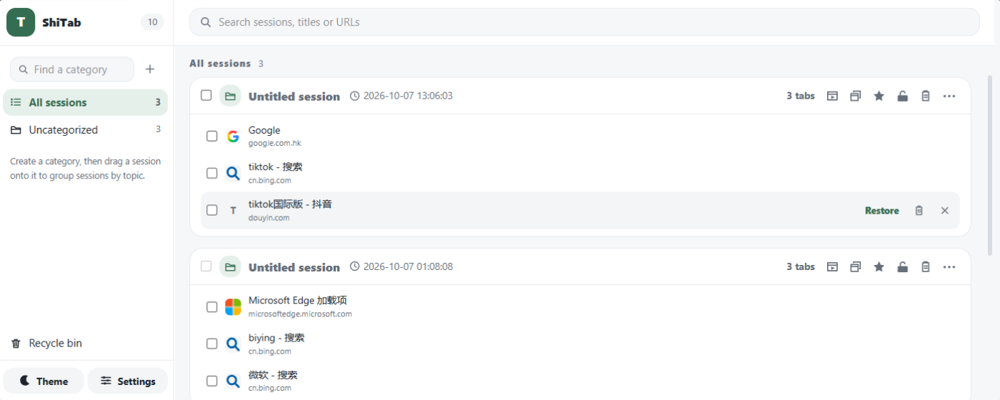
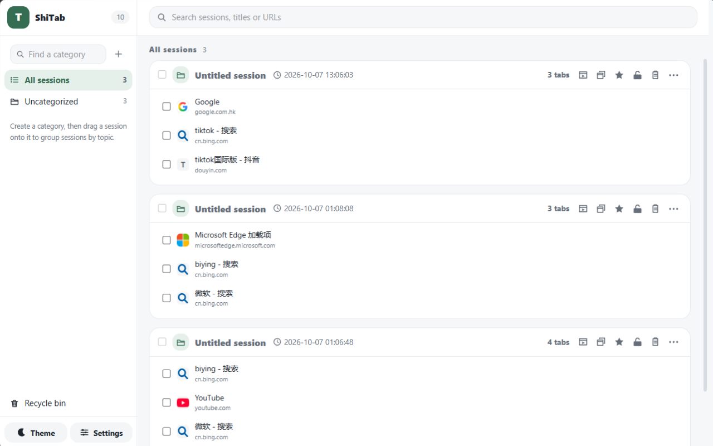
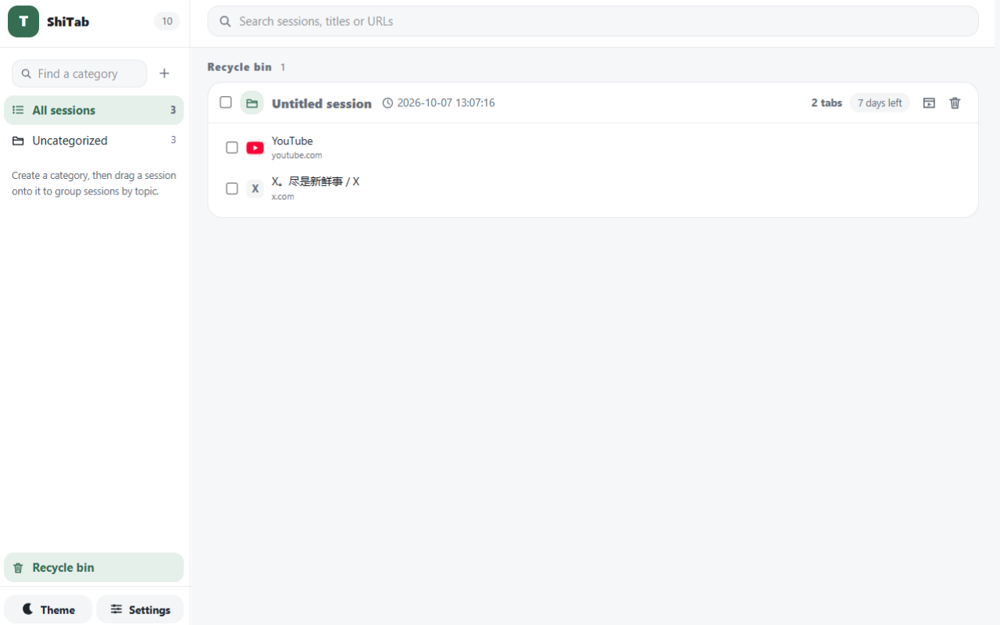
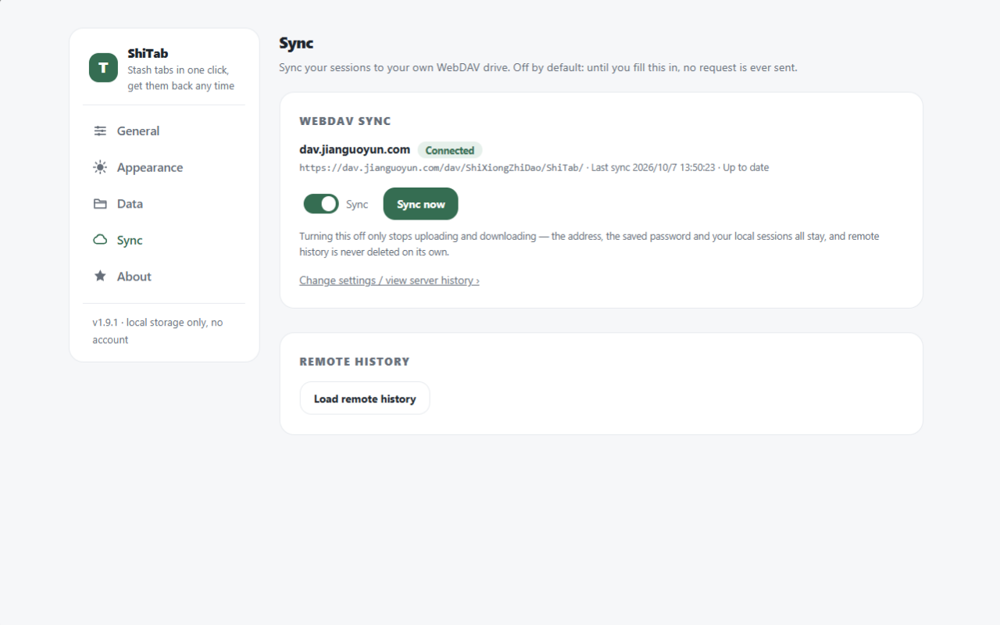
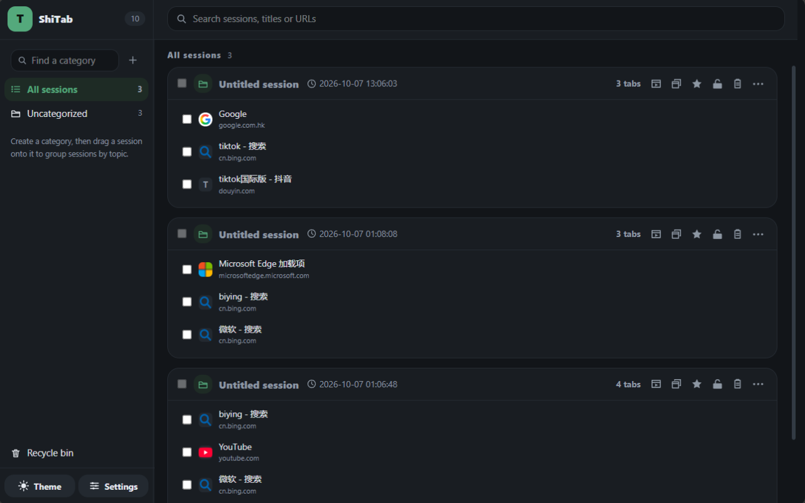

<p align="center"></p>

<h1 align="center">ShiTab</h1>

<p align="center"><em>Every tab in this window, stashed with one click — and back with one click.</em></p>

<p align="center"><strong>English</strong> · <a href="./README.zh-CN.md">简体中文</a></p>

<p align="center">    </p>

<p align="center"></p>

---

## What it does

- Eleven tabs open, done with them for now. **One click on the toolbar icon** and the window collapses
  into a single named group; the window is empty again.
- Later, from anywhere: open the group and the tabs come back **in the order they were in** — into this
  window, a new one, or an incognito one.
- The group name is a placeholder. Click it and type what those tabs were actually about.
- Everything lives in your own browser's local storage. **No account, no server of mine, no telemetry,
  and no permission to read the sites you visit.**
- Want the same lists on a second computer? Point it at a WebDAV folder you already own. Off by default.
- Free, MIT licensed, and the whole project is in this repository — including the tests that pin the
  behaviour described below.

## What it is not

- **Not a cloud tab manager.** Nothing of yours sits on my infrastructure, because I have none.
- **Not a session recorder.** It saves the tabs you put away, not your browsing history — it cannot read
  it (no `history` permission).
- **Not a visual tab grid.** A group is a list of titles and addresses, with favicons loading lazily.
- **Not "keep everything open forever".** A restored group is consumed; if one should stay, lock it.

## Why I built this

My own browser has crashed on me more than once. Every time it came back, the tabs I had stashed in OneTab
were gone. Their sync service would have covered this, but it's $39.99 per licence per year, and I wasn't
going to pay a subscription to keep a list of pages. The other tab-list extensions I tried lost them the
same way.

So the design hangs off the one thing I actually lost: **the list has to outlive the browser.** What you
stash is written into your browser's own local storage *before* any of its tabs close — the same storage that
is still there after a restart, a forced quit or a crash. What does remove it is uninstalling the extension
or clearing site data, which is why *Export as web page* and the optional WebDAV sync exist: a second copy
you hold yourself, not a second copy on someone's server.

## Why this instead of a tab-list extension

You have a dozen tabs open. Every tool you try makes the same trade: it either stores them somewhere you
don't control, or it asks to read the sites you visit.

| What you want | OneTab | ShiTab |
|---|---|---|
| Take the list across browsers | their sync service, **$39.99 per licence per year** | a WebDAV folder you already own: nothing to pay, nothing to register |
| Permissions asked at install | 7 in the build I inspected, including `scripting` and `unlimitedStorage` | **4**: `tabs`, `storage`, `alarms`, `contextMenus` |
| Read the code, reuse it | their site links to no repository | MIT, in this repository |

## Features

### Stashing

Click the toolbar icon: this window's tabs become **one group** and close. One gesture, no menu in
between — a toolbar button that has a popup can't also report a plain click, and that click is the whole
point. Pinned tabs stay put by default; one setting changes that. Pages no extension is allowed to
reopen — `chrome://`, `edge://`, the new-tab page, another extension's own pages — are neither recorded
nor closed: they just stay where they are, so one stash does not always empty the window.

### Getting them back

Restore a group in this window, in a new window, or in an **incognito** window; or open single entries out
of it. Restoring consumes — a fully restored group leaves the list, a restored entry just leaves its
group — with two exceptions: if nothing actually opened, nothing is deleted, and a locked group is never
consumed.

Right-click an entry and you get the **browser's own** link menu (open in new tab / new window /
incognito, copy link), because entries are rendered as real `<a>` elements. I wrote no menu and asked
for no permission to get one.

### Categories

Groups file into categories, many-to-one. Click a category to filter, drag a group onto one to file it,
drag it onto *Unfiled* to take it out. **Deleting a category never deletes its groups** — they fall back
to unfiled. Categories can be dragged into order (a line marks where they'll land) and there's a find box
for when you have many.

### Trash, 7 days

Deleted groups — and entries deleted out of a group — wait 7 days here. Check a whole row, or individual
lines inside it; both granularities live in one view, and a row whose lines are all checked is handled as
a row. *Restore* and *Delete forever* are each two clicks.

Tabs that no browser can re-open (`about:blank`, an extension's own page) **never enter the trash**:
promising a restore I cannot perform is worse than not pretending.

### Locking

A locked group can't be deleted, its entries can't be removed or moved out, and it sits out of drag
reordering. Renaming it, pinning it, adding an entry, restoring it — all still allowed. It's a guard
against accidents, not a vault.

### Handing a list over

Copy all links of a group (title and URL, laid out the way people paste them), or export it as a
**self-contained HTML file** — one file with the titles, the addresses and the time it was taken, no
remote assets and no scripts. There is no "share as a web page": hosting would need a server and a
permission to reach it, and this extension has neither.

### Sync, optional and self-hosted

Off by default. Turn it on and point ShiTab at **your own WebDAV folder** — Nextcloud, ownCloud, a
Synology box or any NAS you already run, 坚果云 (Nutstore) — and it keeps your sessions there. The only
address it ever learns is the one you typed, and the credentials stay on your machine.


- your drive has to hand over a WebDAV address and a folder it lets me write into; Nutstore expects an
  app password generated on its own site, with your account email as the username.

### Settings, theme and language

One page, five sections down its left edge — **General**, **Appearance**, **Data**, **Sync**, **About** —
and the section you're on is in the URL, so it can be linked or bookmarked directly. Light, dark, or
follow the system. English or Chinese, switchable **inside** the extension rather than only shadowing the
browser, and the switch re-renders every surface including the text the background generates. Import and
export your whole state as a file; the About page states your version and where the two repositories are.

### Long lists

No virtualisation library: a group's entries resolve when its card mounts, about 20 cards per screen with
more appended as you reach the bottom, and past 30 entries in one group the tail collapses. Resizing the
left column drags a single ghost line and applies once, on release — the right side doesn't reflow sixty
times a second.

## Screenshots

### The workbench

The extension's own page, pinned at the far left of your tab strip: the **T** next to your leftmost tab.
Categories on the left, every group as a card on the right, each card expandable to its tabs.

<p align="center"><picture> <source media="(prefers-color-scheme: dark)" srcset="assets/screenshots/en/workbench-dark.png">  </picture></p>

### The trash

A deleted group waiting out its 7 days. The chip on the row is the countdown; the two icons at the end of
the row restore it or destroy it.

<p align="center"></p>

### The sync section

One row per state: a summary of what is connected, one switch, one *Sync now*. The configuration sits
behind a disclosure, and the remote history is a separate read.

<p align="center"></p>

### Two themes

Same layout, both palettes. The toggle is the moon/sun button at the bottom of the left column.

| Light | Dark |
|---|---|
|  |  |

## Supported browsers

| Browser | State | How you install it today |
|---|---|---|
| Chrome | used and tested daily | load the built folder unpacked |
| Edge | used and tested daily | load the built folder unpacked |
| Firefox | builds from the same code; **not yet verified on a real Firefox** | temporary add-on |

Manifest V3 on all three. Nothing is published to an extension store yet — which is what the last badge
above says.

## Quick start

**Build it:**

```bash
pnpm install          # dependencies + wxt prepare (generates the types)
pnpm build:all        # .output/chrome-mv3 and .output/firefox-mv3
pnpm dev              # development mode, Chrome/Edge target
pnpm dev:firefox      # development mode, Firefox target
pnpm verify           # typecheck + tests + both builds
```

Requires Node >= 22. The tests, conventions and the reasons behind the layout decisions:
[CONTRIBUTING.md](./CONTRIBUTING.md).

**Load it:**

- **Chrome**: `chrome://extensions` → turn on *Developer mode* → *Load unpacked* → pick
  `.output/chrome-mv3`.
- **Edge**: `edge://extensions` → *Developer mode* → *Load unpacked*.
- **Firefox**: `about:debugging#/runtime/this-firefox` → *Load Temporary Add-on* → its `manifest.json`.

**Use it in 2 minutes:** open a window with ~10 tabs you don't need right now → click the toolbar icon →
the window empties and one group appears → click the **T** in the tab strip → press restore and the tabs
come back in order. Then try four things on one card: click the name to rename it, **lock** it, export it
as a web page, and finally delete it and fish it out of the trash.

## Permissions, plainly

Identical on Chrome, Edge and Firefox: **`tabs`, `storage`, `alarms`, `contextMenus`**.

- `tabs` — to read the titles, addresses and favicons of the tabs you stash, and to close and re-open
  them. This is the only permission that produces an install warning.
- `storage` — everything lives in the browser's own local storage.
- `alarms` — one beat every 5 minutes, and only while sync is on, so a browser with all its tabs closed
  still pulls what the other device pushed.
- `contextMenus` — lets me put the stash actions into two right-click menus: on a web page, and on the
  toolbar icon. I register page-level and action-level items only, so link targets and selected text
  are never handed to me.

`optional_host_permissions` declares `https://*/*` and `http://*/*`, but **required `host_permissions` is
absent**: the optional set produces no install warning, and at runtime only the one origin you typed is
requested, at the moment you press *Connect & sync*.

Never requested: `history`, `bookmarks`, `tabGroups`, `scripting`, `sessions`, `notifications`,
`unlimitedStorage`, `clipboardWrite` — and there is no content script, so the extension never runs inside
the pages you open. Writing the clipboard needs none of those: extension pages are secure contexts and the
write happens inside a user gesture.

## Privacy

No account, no login, no server that receives anything, no analytics code. Groups, categories, the trash
and settings live in your browser's local storage, and clearing site data or uninstalling removes them —
so export a file or turn on syncing before you reset a browser. "Export as web page" writes to a file you
choose. Firefox store metadata declares `data_collection_permissions: none`: I neither collect nor
transmit data.

## FAQ

**Q: Where did my tabs go?**
The icon stashes; it doesn't restore. Click the **T** at the far left of your tab strip — that page holds
every group you have ever stashed.

**Q: Can you see what I have open?**
No. There's no server that receives anything and no reporting code in the extension.

**Q: I restored a group and it vanished from the list.**
That's restore-consumes. Lock a group if you want it to stay, or restore single entries.

**Q: I closed the window by accident.**
Nothing is lost unless you deleted it. Deleted groups wait in the trash for 7 days; open the trash from
the left column and restore the row, or only some lines inside it.

**Q: Some tabs didn't come back.**
`about:blank`, `chrome://` / `edge://` pages and other extensions' pages can't be re-opened by any
extension, so ShiTab doesn't pretend to save them.

**Q: Do I need an account to sync?**
No. You need a WebDAV folder you already control, and its credentials stay on your machine.

**Q: Does it work with my browser's own tab groups?**
Independently. Browser tab groups are a per-window visual thing; a ShiTab group is a saved list that
outlives the window. Nothing is read from or written to `tabGroups` — I don't ask for it.

**Q: Does it work on my phone?**
No. It's a desktop browser extension.

**Q: Which browsers are actually tested?**
Chrome and Edge are used and tested daily. A Firefox build comes from the same code and has not been
verified on a real Firefox yet — that sentence stays here until it is false.

## ☕ Support the author

If ShiTab saves your afternoon, you can buy the author a coffee — thank you, it keeps the project moving.

| Alipay | WeChat Pay |
|---|---|
|  |  |

## License & notice

ShiTab is open source under the **MIT license** — see [LICENSE](./LICENSE).

## 📮 Contact

- GitHub & Gitee: [Gitee](https://gitee.com/ShiXiongZhiDao/ShiTab) ·
  [GitHub](https://github.com/ShiXiongZhiDao/ShiTab)
- WeChat Official Account: **师兄知道** — the same account is on the extension's About page.


