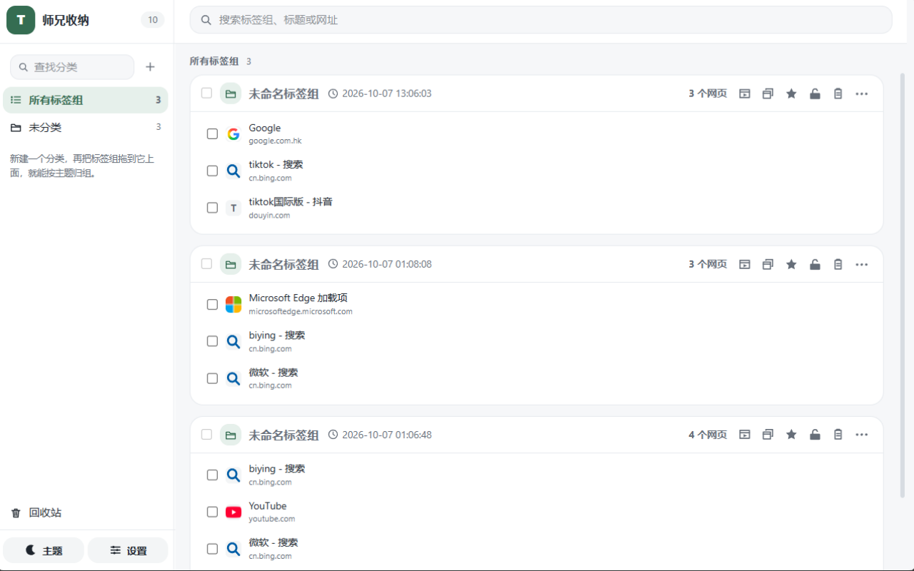
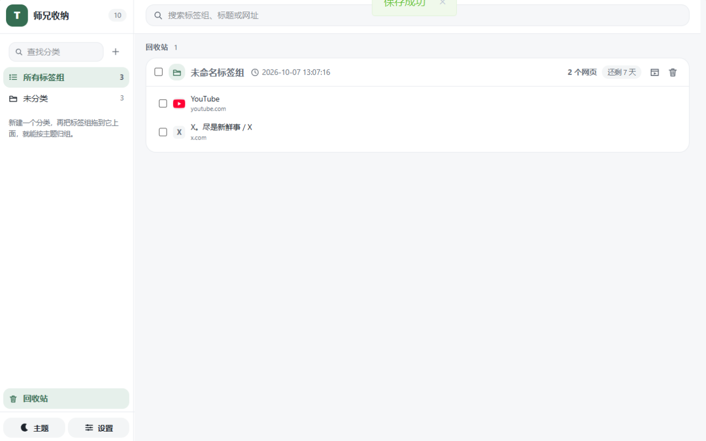
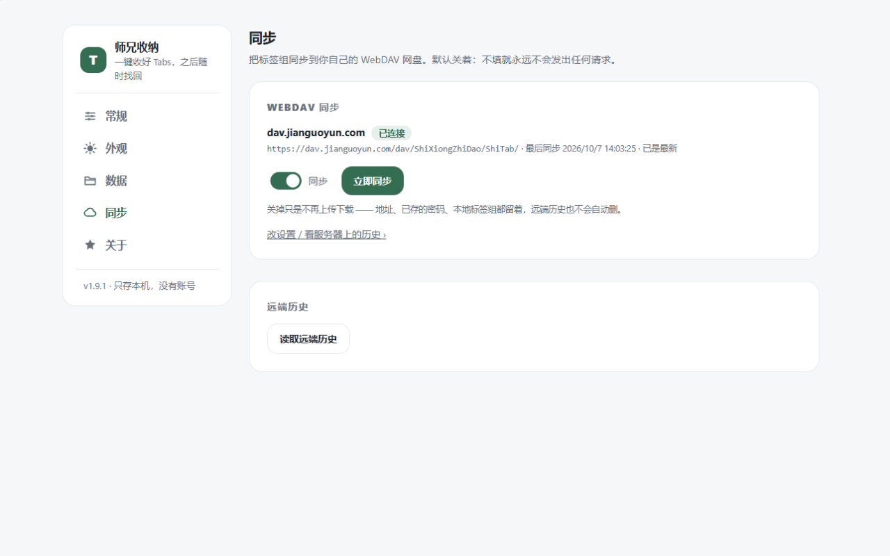
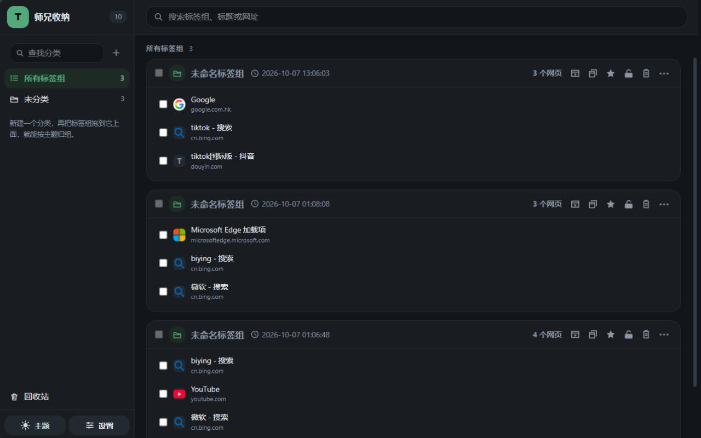

<p align="center"></p>

<h1 align="center">师兄收纳 ShiTab</h1>

<p align="center"><em>窗口的所有标签一键收纳，一键取出。</em></p>

<p align="center"><a href="./README.md">English</a> · <strong>简体中文</strong></p>

<p align="center">    </p>

<p align="center"></p>

---

## 它能做什么

- 开着十一个标签，这一阵子用不着了。**点一下工具栏图标**，整个窗口收成一个有名字的组，窗口立刻空下来。
- 之后在任何地方打开那个组，标签**按原来的顺序**回来 —— 放回当前窗口、开一个新窗口，或者开一个无痕窗口。
- 组名是占位符。点一下就能改成这批标签到底是干什么的。
- 所有东西都在你自己浏览器的本地存储里。**没有账号，没有我们的服务器，没有埋点，也没有读你正在看的网站的权限。**
- 想在第二台电脑上用同一批列表？把它指向一个WebDAV（如坚果云）。默认是关着的。
- 免费，MIT 授权，整个项目都在这个仓库里 —— 包括把下面这些说法钉住的那些测试。

## 它不是什么

- **不是云端标签管理器。** 你的东西不在我们的服务器上，因为我们根本没有服务器。
- **不是会话录制器。** 它存你主动收起来的标签，不存你的浏览历史 —— 它读不到（没申请 `history`）。
- **不是可视化标签墙。** 一个组就是标题加网址的列表，图标按需懒加载。
- **不是"永远都别关"。** 恢复过的组会被消费掉；想让它留着，就锁定它。

## 为什么不是别家标签清单工具

你开着一打标签。试过的工具都做同一个交换：要么把标签存到别人那里，要么申请读你正在看的网站。

| 你想要的是 | OneTab | ShiTab |
|---|---|---|
| 换台电脑继续 | 它家的同步服务，**$39.99 / 授权 / 年** | 你自己已有的 WebDAV 目录：不付费，也不注册 |
| 安装时申请的权限 | 我们读的那个版本里是 7 项，含 `scripting` 与 `unlimitedStorage` | **3 项**：`tabs`、`storage`、`alarms` |
| 读代码、拿去用 | 官网没给仓库链接 | MIT 授权，源码就在本仓库 |

## 功能

### 收纳

点工具栏图标：这个窗口的标签变成**一个组**并关掉。一个动作，中间没有菜单 —— 带了弹层的工具栏按钮就报不出"单纯点了一下"这件事，而那一下正是全部意义。固定标签默认留在原地，设置里可以改。

### 放回来

在当前窗口、新窗口、**无痕窗口**里恢复整个组，或者只从组里打开某几条。恢复即消费 —— 整组恢复完就离开列表，单条恢复只离开它那个组 —— 有两个例外：什么都没真正打开就不会删任何东西，以及**锁定的组永远不被消费**。想让它留着？锁定它。我们不留一个全局开关，因为"要不要留着"是对一个组的判断，不是对浏览器的设置。

右键点某一条，弹出来的是**浏览器自己的**链接菜单（在新标签页 / 新窗口 / 隐身窗口中打开、复制链接地址），因为每条都是真正的 `<a>` 元素。菜单不是我们写的，也没为它申请任何权限。

### 分类

组和分类是多对一：一个组最多归一个分类。点左栏的分类就是筛选，把一个组拖到分类上就是归进去，拖到「未分类」那行就是拿出来。**删分类永远不删它下面的组** —— 组会退回未分类。分类本身可以拖动排序（有一根线标出会落在哪），分类多了还有按名字查找的框。

### 回收站，7 天

被删掉的组，以及从组里删掉的单条，都在这里躺 7 天。可以整行勾选，也可以只勾里面几条，两种粒度在同一个视图里；一行的记录全勾上时按整行处理。「恢复」「彻底删除」都是两步确认。

任何浏览器都打不开的那些（`about:blank`、扩展自己的页面）**根本不会进回收站**：承诺一个做不到的救回，比不承诺更糟。

### 锁定

锁定的组删不掉，里面的条目移不走也删不掉，还不参与拖动排序。改名、置顶、往里加一条、恢复它 —— 都不挡。它是防误操作的写保护，不是保险柜。

### 把一份列表交出去

整组链接一键复制（标题和 URL 按人粘贴的样子排），或者导出成一个**自包含的 HTML 文件**自己留着 —— 不引框架、不加载远程资源。没有"共享为网页"这一项：托管就要有服务器、还得申请访问它的权限，这两样这个扩展都没有。

### 同步，可选、自己托管

默认关着。打开后把它指向**你自己的 WebDAV 目录** —— Nextcloud、ownCloud、群晖或任何局域网里的 NAS、坚果云 —— 标签组就存在那里。它唯一会知道的地址就是你填的那一个，凭据留在你这台机器上。

- 网盘那一侧要给出一个 WebDAV 地址和一个**可写**的目录；坚果云这一家要用它网页端生成的「应用密码」（用户名是你的账号邮箱），设置页的凭据框上方也写着这一句。


### 设置、主题与语言

一个页面，左侧五个分区 —— **常规**、**外观**、**数据**、**同步**、**关于** —— 当前分区写在 URL 里，所以可以直接链接、可以收藏。浅色、深色、或跟随系统。中英文**在扩展里就能切**，不只是跟着浏览器语言，而且一切换就把所有界面重渲染（包括后台生成的那句文案）。整份状态可以导入导出成一份文件；关于页会告诉你现在的版本，以及这个项目的两个仓库地址。

### 列表很长的时候

没引虚拟列表库：一张卡片的条目在挂载时才回源，一屏大约 20 张、滚到底再追加，单组超过 30 条先折叠尾部。拖左栏宽度时只有一根幽灵线在走，松手才落宽 —— 右栏不会一秒重排六十次。

## 截图

### 工作台

扩展自己的那个页面，钉在标签栏最左边：你第一个标签旁边的那个 **T**。左边是分类，右边一个组一张卡，卡片展开就是里面的每条标签。

<p align="center"><picture> <source media="(prefers-color-scheme: dark)" srcset="assets/screenshots/zh/workbench-dark.png">  </picture></p>

### 回收站

一个被删掉的组正在等它的 7 天。行上那颗胶囊就是倒计时；行末两个图标分别负责恢复和彻底删除。

<p align="center"></p>

### 同步那一屏

一种状态一行：连上了就给你一句摘要，一颗开关，一颗「立即同步」。配置收在展开区里，远端历史是另一次读取。

<p align="center"></p>

### 两套主题

布局一模一样，只是配色不同。切换键在左栏底部那颗月亮/太阳。

| 浅色 | 深色 |
|---|---|
|  |  |

## 支持的浏览器

| 浏览器 | 状态 | 现在怎么装 |
|---|---|---|
| Chrome | 每天都在用、都在测 | 开发者模式加载已解压的产物目录 |
| Edge | 每天都在用、都在测 | 开发者模式加载已解压的产物目录 |
| Firefox | 同一份代码构建得出来；**还没在真 Firefox 上验过** | 临时附加组件 |

三端都是 Manifest V3。目前还没上架任何扩展商店 —— 上面最后一枚徽章说的就是这件事。

## 快速开始

**构建：**

```bash
pnpm install          # 装依赖 + wxt prepare 生成类型
pnpm build:all        # .output/chrome-mv3 与 .output/firefox-mv3
pnpm dev              # 开发模式，Chrome/Edge 目标
pnpm dev:firefox      # 开发模式，Firefox 目标
pnpm verify           # 类型检查 + 全部测试 + 两端构建
```

需要 Node >= 22。测试、约定与界面分层的理由请看 [CONTRIBUTING.md](./CONTRIBUTING.md)。

**加载：**

- **Chrome**：`chrome://extensions` → 打开*开发者模式* → *加载已解压的扩展程序* → 选 `.output/chrome-mv3`。
- **Edge**：`edge://extensions` → *开发者模式* → *加载已解压的扩展程序*。
- **Firefox**：`about:debugging#/runtime/this-firefox` → *加载临时附加组件* → 选里面的 `manifest.json`。

**两分钟上手：**开一个存着十几个暂时用不到的标签的窗口 → 点工具栏图标 → 窗口空了，列表里多出一个组 →
点标签栏里那个 **T** → 按恢复，标签按顺序回来。然后在同一张卡上试四件事：点名字改名、**锁定**它、导出为网页，
最后删掉它、再从回收站捞回来。

## 权限说人话

Chrome、Edge、Firefox 完全一样：**`tabs`、`storage`、`alarms`**。

- `tabs` —— 读你要收起来的标签的标题、网址和图标，以及关掉它们、再打开它们。这是唯一会弹安装警告的一项。
- `storage` —— 清单存在浏览器自己的本地存储里。
- `alarms` —— 每 5 分钟一次心跳，而且只在同步开着的时候，为的是一个窗口都没开的浏览器也能把对面推上来的东西拉下来。

`optional_host_permissions` 声明了 `https://*/*` 和 `http://*/*`，但**必需的 `host_permissions` 是缺席的**：
可选那一组不会弹安装警告，运行时只申请你填的那一个源，就在你点「连接并同步」的那一次。

从不申请：`history`、`bookmarks`、`tabGroups`、`scripting`、`sessions`、`notifications`、`unlimitedStorage`、
`clipboardWrite` —— 也没有 content script，所以这个扩展从不在你打开的页面里运行。写剪贴板不需要那几项：
扩展页面是安全上下文，而且写入发生在用户手势里。

## 隐私

没有账号、没有登录、没有接收任何东西的服务器、没有统计代码。组、分类、回收站和设置存在浏览器的本地存储里；
清空站点数据或卸载扩展会把它们一起带走 —— 所以重置浏览器之前先导出文件，或者把同步打开。「导出为网页」写的是你选的那个文件。
Firefox 的商店元数据机器可读地写着 `data_collection_permissions: none`：我们既不收集也不传输数据。

## 常见问题

**问：我的标签去哪儿了？**
图标只负责收，不负责还。点标签栏最左边那个 **T** —— 你收过的每个组都在那一页上。

**问：你们能看到我开着什么吗？**
不能。没有接收任何东西的服务器，扩展里也没有上报代码。

**问：我恢复了一个组，它怎么从列表里消失了？**
这就是"恢复即消费"。想让一个组留着就锁定它，或者只恢复单条。

**问：我手滑把窗口关了。**
只要没删就还在。被删的组在回收站躺 7 天；从左边打开回收站，整行恢复，或者只恢复里面几条。

**问：有几个标签没回来。**
`about:blank`、`chrome://` / `edge://` 这类页面和别的扩展的页面，任何浏览器都打不开，所以 ShiTab 不假装存得住它们。

**问：同步要注册账号吗？**
不要。你需要一个自己已经在用的 WebDAV 目录，凭据也只存在你这台机器上。

**问：它和浏览器自己的标签组冲突吗？**
各干各的。浏览器标签组是一个窗口里的视觉整理；ShiTab 的组是一份活得比窗口长的清单。既不读也不写 `tabGroups` —— 我们没申请它。

**问：手机上有吗？**
没有，这是桌面浏览器扩展。

**问：到底测过哪些浏览器？**
Chrome 和 Edge 是日常在用、逐项验过的。Firefox 的产物由同一份代码构建，还没在真的 Firefox 上验过 —— 这句话留在这里，直到它不成立。

## ☕ 支持作者

如果 ShiTab 帮你省下了一个下午，可以请作者喝杯咖啡 —— 谢谢你，这让项目能继续走下去。

| 支付宝 | 微信支付 |
|---|---|
|  |  |

## 许可与声明

ShiTab 以 **MIT 授权**开源 —— 见 [LICENSE](./LICENSE)。

## 📮 联系

- GitHub & Gitee：[Gitee](https://gitee.com/ShiXiongZhiDao/ShiTab) ·
  [GitHub](https://github.com/ShiXiongZhiDao/ShiTab)
- 公众号：**师兄知道** —— 扩展的关于页里也是这一个


